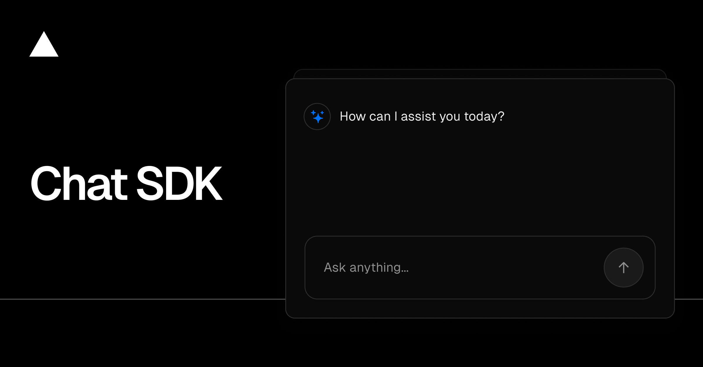

# Cortex Chat SDK

<p align="center">
  
</p>

<p align="center">
  A production-ready AI chatbot with persistent memory, powered by <strong>Cortex Memory</strong>.
</p>

<p align="center">
  <a href="#features"><strong>Features</strong></a> ·
  <a href="#quick-start"><strong>Quick Start</strong></a> ·
  <a href="#cortex-memory-features"><strong>Cortex Memory</strong></a> ·
  <a href="#deployment"><strong>Deployment</strong></a>
</p>

---

## Features

- 🧠 **Long-term Memory** — AI remembers user preferences, facts, and context across conversations
- 📝 **Artifacts** — Interactive documents and code with real-time editing and versioning
- 📎 **Multi-modal** — Support for images, PDFs, and file uploads
- 🔗 **Shareable Chats** — Share conversations via public links
- 🔐 **Auth.js** — Flexible authentication (GitHub, Google, credentials, guest mode)
- ⚡ **Real-time Streaming** — Streaming responses with live memory visualization
- 🔄 **Belief Revision** — Intelligent fact updates when users change their preferences
- 🎯 **Memory Visualization** — Watch the AI retrieve and process memories in real-time

## Tech Stack

- **Framework**: [Next.js 16](https://nextjs.org) with App Router
- **AI**: [Vercel AI SDK](https://ai-sdk.dev) with Cortex Memory Provider
- **Database**: [Convex](https://convex.dev) for real-time data sync
- **Auth**: [Auth.js](https://authjs.dev) v5
- **UI**: [shadcn/ui](https://ui.shadcn.com) + [Tailwind CSS](https://tailwindcss.com)
- **Memory**: [@cortexmemory/sdk](https://cortexmemory.dev) + [@cortexmemory/vercel-ai-provider](https://cortexmemory.dev/docs/integrations/vercel-ai-sdk)

## Prerequisites

- **Node.js 18+** ([download](https://nodejs.org/))
- **pnpm** (recommended) — `npm install -g pnpm`
- **Convex account** (free tier available) — [Sign up](https://dashboard.convex.dev)
- **OpenAI API key** — [Get one](https://platform.openai.com/api-keys)
- **Auth provider** configured (GitHub, Google, or credentials)

## Quick Start

### Option 1: Using Cortex CLI (Recommended)

```bash
# Create a new project
npx cortex create my-chatbot --template chat-sdk

# Navigate to project
cd my-chatbot

# Install dependencies
pnpm install
```

### Option 2: Clone Manually

```bash
# Clone the template
git clone https://github.com/cortexmemory/chat-sdk-quickstart my-chatbot
cd my-chatbot

# Install dependencies
pnpm install
```

### Configure Environment

```bash
# Copy environment template
cp .env.local.example .env.local

# Edit .env.local with your credentials
# Required: AUTH_SECRET, OPENAI_API_KEY (or AI_GATEWAY_API_KEY), CONVEX_URL
```

### Initialize Convex

```bash
# Start Convex development server (creates your deployment)
pnpm convex:dev
```

This will:
1. Create a Convex project (if new)
2. Deploy the Cortex Memory schema
3. Set your `CONVEX_URL` in `.env.local`

### Start Development

```bash
pnpm dev
```

Visit [http://localhost:3000](http://localhost:3000) to see your chatbot.

## Environment Variables

| Variable | Required | Description |
|----------|----------|-------------|
| `AUTH_SECRET` | Yes | Auth.js secret for JWT signing. Generate with `openssl rand -base64 32` |
| `OPENAI_API_KEY` | Yes* | OpenAI API key for GPT models and embeddings |
| `AI_GATEWAY_API_KEY` | Yes* | Vercel AI Gateway API key (alternative to OpenAI direct) |
| `CONVEX_URL` | Yes | Your Convex deployment URL (auto-set by `pnpm convex:dev`) |
| `MEMORY_SPACE_ID` | No | Memory space name (default: `chat-sdk-demo`) |
| `CORTEX_FACT_EXTRACTION` | No | Enable LLM-powered fact extraction (default: `true`) |
| `CORTEX_FACT_EXTRACTION_MODEL` | No | Model for fact extraction (default: `gpt-4o-mini`) |
| `REDIS_URL` | No | Redis URL for resumable streams (optional) |

*Either `OPENAI_API_KEY` or `AI_GATEWAY_API_KEY` is required.

### Optional: Graph Database

| Variable | Description |
|----------|-------------|
| `CORTEX_GRAPH_SYNC` | Enable automatic graph sync (`true`/`false`) |
| `NEO4J_URI` | Neo4j connection URI (e.g., `bolt://localhost:7687`) |
| `NEO4J_USERNAME` | Neo4j username |
| `NEO4J_PASSWORD` | Neo4j password |

### Auth Provider Setup

For GitHub OAuth:

```env
AUTH_GITHUB_ID=your-github-oauth-app-id
AUTH_GITHUB_SECRET=your-github-oauth-app-secret
```

For Google OAuth:

```env
AUTH_GOOGLE_ID=your-google-client-id
AUTH_GOOGLE_SECRET=your-google-client-secret
```

## Cortex Memory Features

This template showcases the full power of Cortex Memory orchestration. Every message flows through multiple memory layers.

### Memory Layer Architecture

| Layer | Purpose | Example |
|-------|---------|---------|
| **Memory Space** | Multi-tenant isolation | `chat-sdk-demo` |
| **User** | User profile and identity | Authenticated user from Auth.js |
| **Agent** | AI agent participant | `chat-sdk-assistant` |
| **Conversation** | Message history and threading | Current chat session |
| **Vector** | Semantic similarity search | "Similar to previous discussions about..." |
| **Facts** | Extracted structured knowledge | "User prefers dark mode" |
| **Graph** | Entity relationships (optional) | "User → works_at → Company" |

### Memory Orchestration

Every message automatically:
1. **Retrieves context** from vector search, facts, and conversation history
2. **Extracts new facts** using LLM-powered extraction
3. **Updates beliefs** when user preferences change (Belief Revision)
4. **Stores memories** for future retrieval

### Belief Revision

When users change their preferences, Cortex intelligently updates existing facts:

```
User: "I like blue"
→ Creates fact: { subject: "user", predicate: "prefers_color", object: "blue" }

User: "Actually, I prefer purple now"
→ SUPERSEDES old fact, creates: { subject: "user", predicate: "prefers_color", object: "purple" }
```

Revision actions:
- `CREATE` — New fact with no conflicts
- `UPDATE` — Existing fact refined with new details
- `SUPERSEDE` — Old fact replaced by contradicting information
- `NONE` — Duplicate or irrelevant, no storage needed

### Memory Visualization

The **Memory Retrieval Panel** shows real-time progress as the AI:
- Retrieves from each memory layer
- Displays latency per layer
- Shows retrieved data previews
- Indicates processing status with animated indicators

## Project Structure

```
chat-sdk-quickstart/
├── app/
│   ├── (auth)/              # Auth pages and API routes
│   │   ├── login/
│   │   ├── register/
│   │   └── api/auth/
│   ├── (chat)/              # Chat pages and API routes
│   │   ├── api/chat/        # Main chat endpoint with Cortex
│   │   ├── chat/[id]/       # Individual chat page
│   │   └── page.tsx         # Home/new chat page
│   └── share/[id]/          # Public shared chat view
├── artifacts/               # Document/code artifact handlers
├── components/
│   ├── memory-retrieval-panel.tsx  # Cortex memory visualization
│   ├── chat.tsx             # Main chat component
│   └── ui/                  # shadcn/ui components
├── convex/
│   └── schema.ts            # Convex schema (app tables only)
├── hooks/                   # React hooks
├── lib/
│   ├── ai/
│   │   ├── providers.ts     # AI model configuration
│   │   ├── prompts.ts       # System prompts
│   │   └── tools/           # AI tools (weather, documents)
│   ├── cortex-memory-config.ts  # Cortex configuration factory
│   ├── cortex.ts            # Cortex SDK helpers
│   └── db/
│       └── queries.ts       # Convex query wrappers
└── tests/                   # Playwright E2E tests
```

## Key Files for Customization

### Chat API Route

`app/(chat)/api/chat/route.ts` — Main endpoint that integrates Cortex Memory:

```typescript
import { createCortexMemoryAsync } from "@cortexmemory/vercel-ai-provider";
import { getCortexMemoryConfig } from "@/lib/cortex-memory-config";

// Create memory configuration
const cortexConfig = getCortexMemoryConfig(
  getMemorySpaceId(),
  session.user.id,
  chatId,
  layerObserver, // For UI visualization
);

// Wrap your model with Cortex Memory
const cortexMemory = await createCortexMemoryAsync(cortexConfig);

const result = streamText({
  model: cortexMemory(getLanguageModel(selectedModel)),
  messages,
  // ... tools and options
});
```

### Cortex Configuration

`lib/cortex-memory-config.ts` — Centralized memory configuration:

```typescript
export function getCortexMemoryConfig(
  memorySpaceId: string,
  userId: string,
  conversationId: string,
  layerObserver?: LayerObserver,
): CortexMemoryConfig {
  return {
    convexUrl: process.env.CONVEX_URL!,
    memorySpaceId,
    userId,
    agentId: "chat-sdk-assistant",
    conversationId,
    enableFactExtraction: process.env.CORTEX_FACT_EXTRACTION === "true",
    beliefRevision: {
      enabled: true,
      slotMatching: true,
      llmResolution: true,
    },
    embeddingProvider: {
      generate: async (text) => {
        const result = await embed({
          model: openai.embedding("text-embedding-3-small"),
          value: text,
        });
        return result.embedding;
      },
    },
  };
}
```

## Deployment

### Deploy to Vercel

```bash
# Install Vercel CLI
npm i -g vercel

# Deploy
vercel

# Set environment variables in Vercel dashboard
# Or use: vercel env add AUTH_SECRET
```

### Deploy Convex to Production

```bash
# Deploy to production Convex
pnpm convex:deploy
```

### One-Click Deploy

[](https://vercel.com/new/clone?repository-url=https://github.com/cortexmemory/chat-sdk-quickstart)

### Production Checklist

- [ ] Set `AUTH_SECRET` with a strong random value
- [ ] Configure OAuth providers (GitHub, Google)
- [ ] Deploy Convex to production (`pnpm convex:deploy`)
- [ ] Set `CONVEX_URL` to production deployment URL
- [ ] Configure `REDIS_URL` for resumable streams (optional)
- [ ] Enable analytics with `VERCEL_ANALYTICS=true`

## Testing

```bash
# Run E2E tests
pnpm test

# Run with UI
pnpm exec playwright test --ui
```

## Based On

This template is based on [vercel/ai-chatbot](https://github.com/vercel/ai-chatbot) at commit `9d5d8a3ea7968522a37ab1cc145a6c0ef8a9dd2e`, with the following modifications:

- **Replaced PostgreSQL** with Cortex Memory (Convex-backed)
- **Added Cortex Memory orchestration** for persistent AI memory
- **Added Memory Retrieval Panel** for real-time visualization
- **Integrated Belief Revision** for intelligent fact management
- **Added fact extraction** for automatic knowledge capture

## Learn More

- [Cortex Memory Documentation](https://cortexmemory.dev/docs)
- [Vercel AI SDK Documentation](https://ai-sdk.dev/docs)
- [Convex Documentation](https://docs.convex.dev)
- [Auth.js Documentation](https://authjs.dev)

## License

MIT
